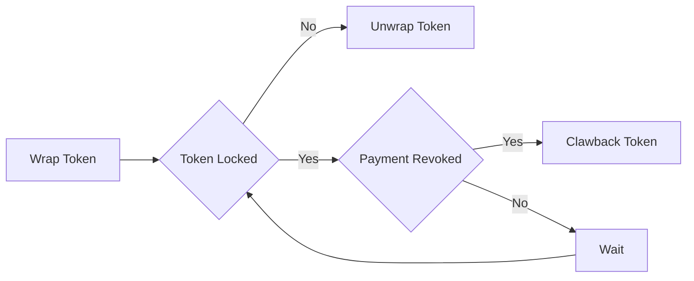
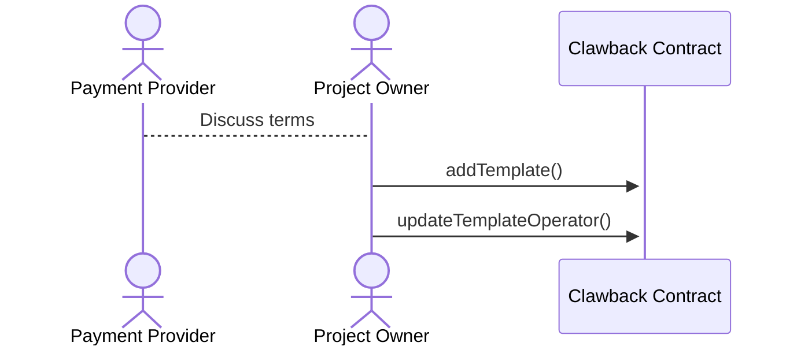
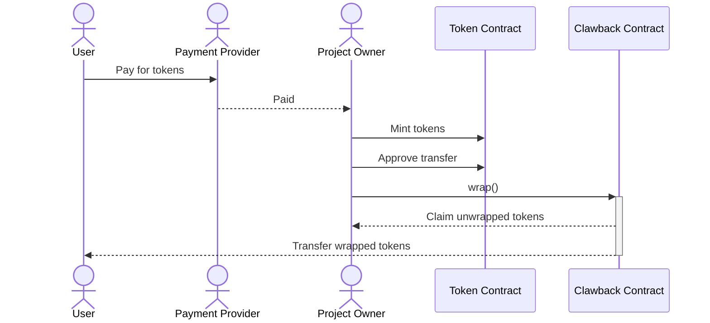
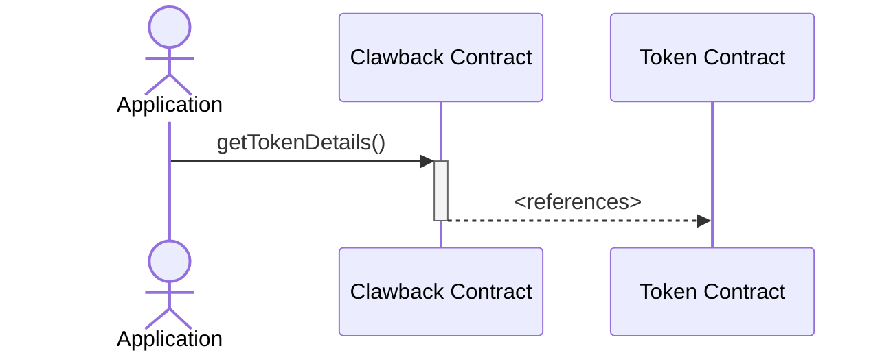
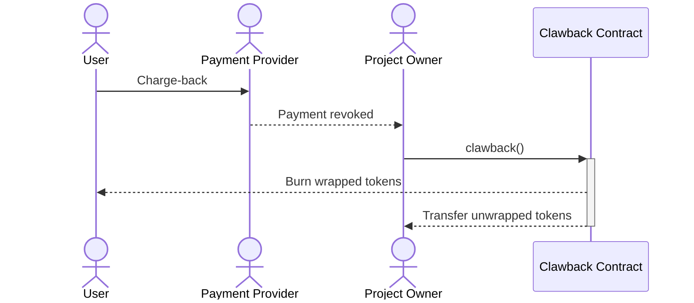
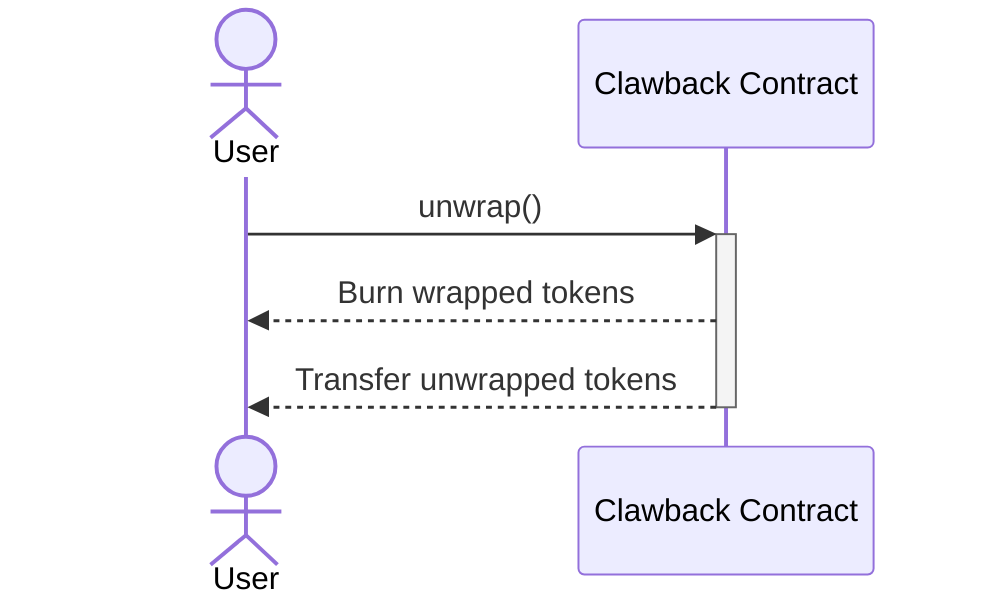

# Clawback

The Clawback contract is a wrapper for ERC-20/721/1155 tokens that allows the contract owner to clawback tokens from users. This is useful for situations where tokens need to be recovered from users, such as in the case of a security breach, funds revoked or a user violating terms of service.

## Terminology

- **Wrapped Token**: The ERC-1155 token provided by the Clawback contract. When a token is "wrapped", the recipient receives a wrapped token instance.
- **Unwrapped Token**: The underlying ERC-20/721/1155 token that is wrapped by the Clawback contract. The wrapped token is backed by the unwrapped token.
- **Template**: The parameters that define the permissions of the wrapped token. The template is created by the template admin and is used to wrap tokens.
- **Clawback**: The mechanism for the operator to recover unwrapped tokens. The operator is able to clawback tokens from users while the token is locked.
- **Lock Duration**: The period for which the wrapped token is locked. A token is only able to be clawed back by the operator while it is locked.

## Roles

There are 4 "roles" when interacting with the Clawback contract:

1. **Contract Owner**: The owner of the Clawback contract only has the ability to update the metadata provider.
2. **Template Admin**: A template admin is able to create and update templates to the Clawback contract. A template admin is usually the project owner of the unwrapped token or a payment provider.
3. **Operator**: An operator is able to clawback tokens from users. An operator is affiliated with the template admin. The operator may be the template admin.
4. **User**: A user is any unauthenticated address. A user is able to wrap and unwrap tokens.

## Flows

In the basic flow, the user obtains a wrapped token from the payment provider. This token is locked until the template duration expires. If the payment is revoked, the payment provider can clawback the token. Once the lock period expires, the user can unwrap the token.

In the below examples, the "Project Owner" is both the template admin and operator. The "Payment Provider" is a third party that manages payments between the user and the project owner. The payment provider has no knowledge of blockchain technology.

### Create Template

The template admin creates a new Clawback template. The template admin is able to update the template at any time.

When selecting a duration, the template admin should consider the period for which the user is able to issue a charge-back or refund. The lock duration should be longer than the charge-back period.

Transfer permissions allow the user to transfer the wrapped token to another address. The new owner of the wrapped token now carries the risk of having the token clawed back. Enabling this feature is a trade-off between security and usability.

"Destruction only" forces tokens that are clawed back to be destroyed. This is a positive setting for the user as it eliminates the ability for a bad operator to steal the user's tokens for themselves. If the project would like to reuse a token that has been clawed back, this feature should be disabled.

> [!IMPORTANT]
> The template admin is only able to update the template in a way that benefits the token holder. Changing from more to less restrictive permissions is allowed, but not the other way around. Reducing the lock duration is allowed, but increasing it is not. The template admin should be careful to select appropriate parameters when creating the template.

### Wrapping Tokens

While obtaining tokens for wrapping is outside the responsibility of the Clawback contract. An example of how this could be done is below:

> [!NOTE]
> While a token is wrapped, the clawback contract will be the owner of the unwrapped token. This contract should be removed from analytics and other services that track token ownership.

At any time after wrapping, more tokens may be added to the wrapped instance by calling the `addToWrap` function. This only applies to wrapped ERC-20 and ERC-1155 tokens. Newly wrapped tokens have the same parameters as the originally wrapped tokens. Adding will not change the unlock duration. This can be performed even after the clawback duration has ended.

### Wrapped Token Integration

The wrapped token can be integrated into the project in any way the project owner sees fit. The wrapped token can be used in game utility, marketplace integration or any other way the project owner sees fit. The project owner should use the `getTokenDetails(uint256 wrappedTokenId)` function to get the underlying unwrapped token details.

### Clawback

If the payment is revoked, an approved operator is able to clawback the token. The operator is able to clawback the token at any time before the lock duration expires. The operator is only able to clawback tokens that are still in a locked state.

> [!IMPORTANT]
> If the template is set to "Destruction only", the unwrapped tokens will be destroyed instead of being transferred to the operator.

### Unwrapping Tokens

After the lock duration has expired, the user or approved operator is able to unwrap the token.

## Metadata

The owner of the Clawback contract is able to update the metadata provider. The provider will generate the metadata for the wrapped tokens. The metadata provider is able to update the metadata for the wrapped tokens.

### Clawback Metadata

The Clawback Metadata contract is an implementation of the metadata provider for a Clawback instance. This contract combines on chain information to construct a JSON payload with metadata. The metadata is constructed using the wrapped token details, the template details and the metadata of the underlying token.
